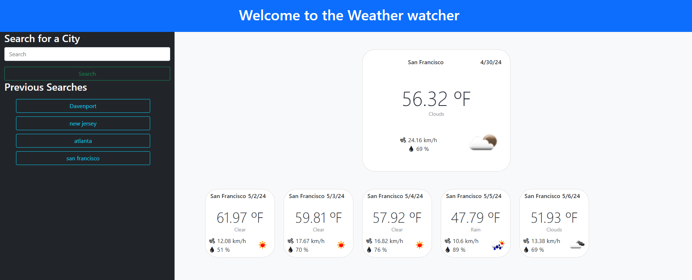

# Weather-checker

## Description 

This project aims to develop a weather forecast page to improve planning activities outdoors based on the weather conditions, leveraging openWeather's geocoding and 5 day forecast APIs.

## Instalation

N/A

## Usage

Once you open it it will look for the weather conditions in the last new city you looked for, if there are none it will default to New York. In order to use this web application enter the name of the city you want to check the weather for in the search bar, click on the search button to initiaze the search.
After searching for a city for a city, a button with the name of the city will appear in the History section bellow the search bar, click on any of the buttons to retrieve the weather information for that city again. 

## Credits

N/A

## Screenshot displaying the deployed site

## URL to the deployed site

https://fabricioguac.github.io/weather-checker/

## License

MIT License

Copyright (c) 2024 fabricioGuac

Permission is hereby granted, free of charge, to any person obtaining a copy
of this software and associated documentation files (the "Software"), to deal
in the Software without restriction, including without limitation the rights
to use, copy, modify, merge, publish, distribute, sublicense, and/or sell
copies of the Software, and to permit persons to whom the Software is
furnished to do so, subject to the following conditions:

The above copyright notice and this permission notice shall be included in all
copies or substantial portions of the Software.

THE SOFTWARE IS PROVIDED "AS IS", WITHOUT WARRANTY OF ANY KIND, EXPRESS OR
IMPLIED, INCLUDING BUT NOT LIMITED TO THE WARRANTIES OF MERCHANTABILITY,
FITNESS FOR A PARTICULAR PURPOSE AND NONINFRINGEMENT. IN NO EVENT SHALL THE
AUTHORS OR COPYRIGHT HOLDERS BE LIABLE FOR ANY CLAIM, DAMAGES OR OTHER
LIABILITY, WHETHER IN AN ACTION OF CONTRACT, TORT OR OTHERWISE, ARISING FROM,
OUT OF OR IN CONNECTION WITH THE SOFTWARE OR THE USE OR OTHER DEALINGS IN THE
SOFTWARE.